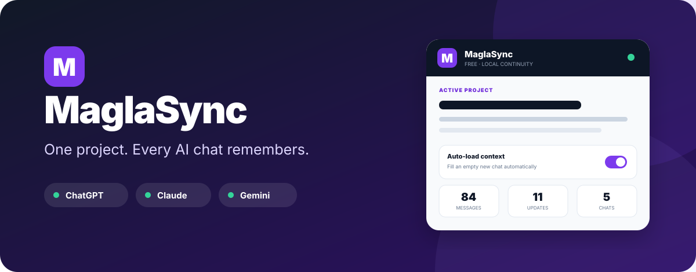
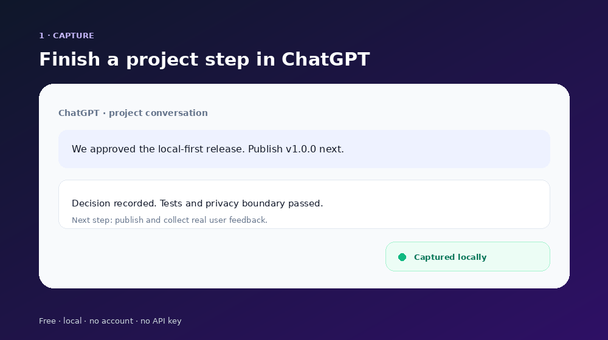
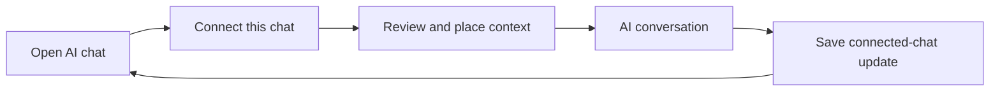

<div align="center">
  
</div>

<p align="center">
  <strong>A free browser extension that carries project context between the ChatGPT, Claude, and Gemini chats you explicitly connect.</strong>
</p>

<p align="center">
  <a href="https://github.com/340867-ux/MaglaSync/releases/latest"></a>
  <a href="https://github.com/340867-ux/MaglaSync/actions/workflows/quality.yml"></a>
  <a href="LICENSE"></a>
  <a href="https://github.com/340867-ux/MaglaSync/stargazers"></a>
</p>

<p align="center">
  <a href="https://sync.magla.ru/">Product page</a> ·
  <a href="https://sync.magla.ru/en/">English</a> ·
  <a href="https://github.com/340867-ux/MaglaSync/releases/latest">Download</a> ·
  <a href="INSTALL.md">2-minute install</a> ·
  <a href="PRIVACY.md">Privacy</a>
</p>

<p align="center">
  
</p>

## Stop teaching every new chat the same project

You spend days working with an AI chat. Then the conversation gets too long, you switch models, or you open a fresh chat—and the new AI knows nothing.

**MaglaSync creates one local project memory shared only by the AI chats you choose.**

- Every chat starts disconnected and is not read until you click **Connect chat**.
- Only connected chats can add recent messages and structured project updates to the journal.
- You review and can edit the complete handoff before placing it in a chat box.
- MaglaSync never presses **Send** for you.

No copying a handoff document every time. No API key. No MaglaSync account. No external database.

> If MaglaSync saves you from repeating project context, a GitHub star helps the next person discover it.

## What the Free edition does

| Included | Behaviour |
| --- | --- |
| One local project | Goal, rules, recent messages, and structured state |
| ChatGPT | User-connected project chats on `chatgpt.com` |
| Claude | User-connected project chats on `claude.ai` |
| Gemini | User-connected project chats on `gemini.google.com` |
| Local journal | 24 recent messages by default; extended history up to 400 is opt-in |
| Integrity checks | SHA-256 chain detects silent changes or partial history |
| Backup and restore | Portable JSON file owned by the user |
| Human control | Review, edit, place in chat, and press Send yourself |

## The consent-first loop



At the start of a connected project conversation, MaglaSync includes a small continuity rule. When the AI reaches a material decision or result, it can return a `maglasync` update block. The extension reads that block into the project journal. AI-reported completion is labelled as reported, not independently verified by MaglaSync.

## Install the GitHub edition

Until the Chrome Web Store listing is approved, the GitHub release installs through Chrome's standard developer mode:

1. Download `maglasync-free-chromium-v1.2.0.zip` from [Releases](https://github.com/340867-ux/MaglaSync/releases/latest).
2. Unzip it.
3. Open `chrome://extensions` in Chrome or Edge.
4. Turn on **Developer mode**.
5. Click **Load unpacked** and select the unzipped folder.
6. Pin MaglaSync and create the free project.

Full illustrated instructions: [INSTALL.md](INSTALL.md).

> GitHub cannot provide one-click installation for ordinary Chrome users. Public one-click installation requires a Chrome Web Store listing. This repository and release are the inspectable GitHub edition.

## Privacy you can verify

The extension requests only:

- `storage` — to keep the project locally;
- access to `chatgpt.com`, `claude.ai`, and `gemini.google.com` — to show the panel, read messages only after that exact chat is connected, and place reviewed context in the composer.

It contains no analytics library, advertising code, backend URL, remote script, or AI API client. A source scan and the test suite enforce those boundaries.

Opening a supported site does not grant a conversation access to the project. Message capture is rejected until the user connects that exact chat. The Free edition stores connected-chat data locally and does not send it to MaglaSync or MAGLA servers. See the complete [privacy disclosure](PRIVACY.md).

## Free first, Pro only if people want it

The local Free workflow stands on its own. A future paid MaglaSync Pro may add:

- multiple projects;
- encrypted synchronization between devices;
- teams and permissions;
- longer history and automatic semantic compression;
- more AI services;
- signed checkpoints and API access.

No paid edition is required to keep using one local project.

## Platform packages

| Package | Status |
| --- | --- |
| Chromium: Chrome 114+, Edge 114+ | Supported GitHub edition; store review pending |
| Brave and Opera desktop | Uses the Chromium package; not release-gated on every version |
| Firefox desktop and Android | Event-page release candidate; Mozilla signing and real-device acceptance test pending |
| Safari on macOS, iPhone, and iPad | Conversion source ready; Apple signing and App Store review pending |
| Chrome on Android | Chrome does not provide a mobile extension install channel |

The browser store is the proper installer for an extension. We do not ship a misleading `.exe` or `.dmg` that merely tries to sideload the same package. See the honest [platform matrix](docs/PLATFORM_MATRIX.md) and [Free/Pro architecture](docs/ARCHITECTURE.md).

AI sites change their page structure over time. If capture or composer loading stops on a supported site, open an issue with the site name and visible behaviour—never include a private conversation.

## Development and verification

MaglaSync is Manifest V3 and uses no third-party runtime dependency.

```bash
node --test
node tools/package.mjs --check
node tools/package.mjs
```

The package check rejects unexpected extension permissions and verifies every required release file. GitHub Actions repeats tests and packaging on every push and pull request.

## Security boundary

The integrity chain detects changes inside an existing saved history. It is not a digital signature and cannot prove that an AI statement is true. The context explicitly separates AI-reported results from plans, but users should still point important claims to real evidence.

Read [SECURITY.md](SECURITY.md) before high-stakes use.

## Support and sharing

- Report a problem using the private-data-safe [bug form](https://github.com/340867-ux/MaglaSync/issues/new?template=bug_report.yml).
- Suggest a capability using the [feature form](https://github.com/340867-ux/MaglaSync/issues/new?template=feature_request.yml).
- Share the [Russian/CIS product page](https://sync.magla.ru/), [English page](https://sync.magla.ru/en/), or the prepared [launch kit](docs/LAUNCH_KIT.md).
- Russian Telegram, YouTube, TikTok, VK, and Habr copy is ready in the [CIS promo pack](docs/PROMO_RU.md).
- Chrome Web Store submission materials are ready in [`assets/store`](assets/store) with exact field copy in [the listing pack](docs/CHROME_WEB_STORE_LISTING.md).

## License

[MIT](LICENSE). Built as the first public MAGLA utility.
