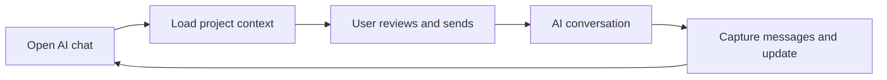

<div align="center">
  
</div>

<p align="center">
  <strong>A free browser extension that automatically carries project context between ChatGPT, Claude, and Gemini.</strong>
</p>

<p align="center">
  <a href="https://github.com/340867-ux/MaglaSync/releases/latest"></a>
  <a href="https://github.com/340867-ux/MaglaSync/actions/workflows/quality.yml"></a>
  <a href="LICENSE"></a>
  <a href="https://github.com/340867-ux/MaglaSync/stargazers"></a>
</p>

<p align="center">
  <a href="https://340867-ux.github.io/MaglaSync/">Product page</a> ·
  <a href="https://github.com/340867-ux/MaglaSync/releases/latest">Download</a> ·
  <a href="INSTALL.md">2-minute install</a> ·
  <a href="PRIVACY.md">Privacy</a>
</p>

<p align="center">
  
</p>

## Stop teaching every new chat the same project

You spend days working with an AI chat. Then the conversation gets too long, you switch models, or you open a fresh chat—and the new AI knows nothing.

**MaglaSync creates one local project memory shared by your supported AI chats.**

- New messages are captured automatically.
- Structured decisions, verified results, blockers, and next steps return to the journal automatically.
- An empty new chat is filled with the current project context automatically.
- You review the prepared context and press **Send** yourself.

No copying a handoff document every time. No API key. No MaglaSync account. No external database.

> If MaglaSync saves you from repeating project context, a GitHub star helps the next person discover it.

## What the Free edition does

| Included | Behaviour |
| --- | --- |
| One local project | Goal, rules, messages, and structured state |
| ChatGPT | Automatic capture and context loading on `chatgpt.com` |
| Claude | Automatic capture and context loading on `claude.ai` |
| Gemini | Automatic capture and context loading on `gemini.google.com` |
| Local journal | Messages remain in Chrome extension storage |
| Integrity checks | SHA-256 chain detects silent changes or partial history |
| Backup and restore | Portable JSON file owned by the user |
| Human control | MaglaSync fills the message box but never presses Send |

## The automatic loop



At the start of a project conversation, MaglaSync includes a small continuity rule. When the AI reaches a material decision or result, it returns a `maglasync` update block. The extension reads that block into the project journal. If a model omits the block, recent messages are still retained for the next chat.

## Install the GitHub edition

Until the Chrome Web Store listing is approved, the GitHub release installs through Chrome's standard developer mode:

1. Download `maglasync-free-v1.0.0.zip` from [Releases](https://github.com/340867-ux/MaglaSync/releases/latest).
2. Unzip it.
3. Open `chrome://extensions` in Chrome or Edge.
4. Turn on **Developer mode**.
5. Click **Load unpacked** and select the unzipped folder.
6. Pin MaglaSync and create the free project.

Full illustrated instructions: [INSTALL.md](INSTALL.md).

> GitHub cannot provide one-click installation for ordinary Chrome users. Public one-click installation requires a Chrome Web Store listing. This repository and release are the inspectable GitHub edition.

## Privacy you can verify

The extension requests only:

- `storage` — to keep the project locally;
- access to `chatgpt.com`, `claude.ai`, and `gemini.google.com` — to read supported chat messages and fill the composer.

It contains no analytics library, advertising code, backend URL, remote script, or AI API client. A source scan and the test suite enforce those boundaries.

MaglaSync necessarily reads messages on the three supported sites when capture is enabled. That is its function. The Free edition stores those messages locally and does not send them to MaglaSync or MAGLA servers. See the complete [privacy disclosure](PRIVACY.md).

## Free first, Pro only if people want it

The local Free workflow stands on its own. A future paid MaglaSync Pro may add:

- multiple projects;
- encrypted synchronization between devices;
- teams and permissions;
- longer history and automatic semantic compression;
- more AI services;
- signed checkpoints and API access.

No paid edition is required to keep using one local project.

## Current compatibility

| Browser | Status |
| --- | --- |
| Google Chrome 114+ | Supported |
| Microsoft Edge 114+ | Supported through Chromium extension mode |
| Brave and other Chromium browsers | Expected to work; not release-gated yet |
| Firefox | Not included in v1.0 |
| Safari | Not included in v1.0 |

AI sites change their page structure over time. If capture or composer loading stops on a supported site, open an issue with the site name and visible behaviour—never include a private conversation.

## Development and verification

MaglaSync is Manifest V3 and uses no third-party runtime dependency.

```bash
node --test
node tools/package.mjs --check
node tools/package.mjs
```

The package check rejects unexpected extension permissions and verifies every required release file. GitHub Actions repeats tests and packaging on every push and pull request.

## Security boundary

The integrity chain detects changes inside an existing saved history. It is not a digital signature and cannot prove that an AI statement is true. The context explicitly separates verified results from plans, but users should still point important claims to real evidence.

Read [SECURITY.md](SECURITY.md) before high-stakes use.

## Support and sharing

- Report a problem using the private-data-safe [bug form](https://github.com/340867-ux/MaglaSync/issues/new?template=bug_report.yml).
- Suggest a capability using the [feature form](https://github.com/340867-ux/MaglaSync/issues/new?template=feature_request.yml).
- Share the [product page](https://340867-ux.github.io/MaglaSync/) or use the prepared [launch kit](docs/LAUNCH_KIT.md).
- Chrome Web Store submission materials are ready in [`assets/store`](assets/store) with exact field copy in [the listing pack](docs/CHROME_WEB_STORE_LISTING.md).

## License

[MIT](LICENSE). Built as the first public MAGLA utility.
