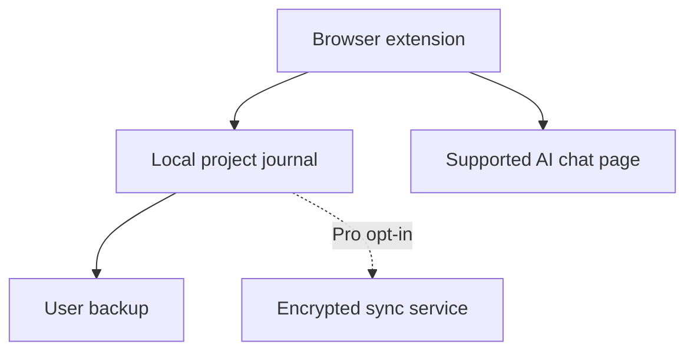

# MaglaSync product architecture

## Decision

MaglaSync Free is local-first. A future MaglaSync Pro adds optional encrypted cloud synchronization; the product does not become cloud-only.

This split is deliberate:

- Free remains useful without registration, a server, or a subscription.
- Chat text stays in browser extension storage unless the user explicitly enables a future sync plan.
- Browser extensions keep doing user-approved page-level capture and reviewed composer placement. A cloud website alone cannot safely read another site's chat page.
- Pro can monetize cross-device convenience instead of holding the core workflow hostage.
- Server cost and security exposure begin only when a user asks for server-backed features.

## Editions

| Capability | Free | Pro direction |
| --- | --- | --- |
| Projects | One local project | Multiple projects and workspaces |
| Browser capture | Explicitly connected ChatGPT, Claude, Gemini chats | More services and configurable adapters |
| Storage | Browser profile | Local plus opt-in encrypted synchronization |
| Devices | Manual encrypted-backup roadmap; current JSON backup | Automatic device synchronization |
| Teams | No | Roles, shared projects, audit history |
| Account | No | Required only for cloud features |
| Price | Free forever for the included scope | Subscription or one-time plan to validate later |

## Cloud security boundary

The future sync design should encrypt project payloads on the client before upload. The server should receive ciphertext, account/device identifiers, version metadata, and the minimum operational telemetry required to run synchronization. Server-side search or AI processing must be a separate, explicit feature because it changes that privacy boundary.

Recovery is the hard tradeoff: true end-to-end encryption means MAGLA cannot recover lost encryption keys. Before Pro development, the product must choose and document a recovery model instead of quietly weakening encryption.

## Components

The extension shows its panel on supported chat pages but reads messages only after the user connects that exact conversation. It shows context in a separate editable preview before placing it in a composer and never presses Send. The local journal remains the source of truth for Free. The future Pro service synchronizes encrypted state; it does not replace the extension.

## Monetization sequence

1. Earn trust and usage with a complete Free release.
2. Measure requests for multiple projects and device sync through issues and a waitlist.
3. Build accounts and encrypted sync only after demand is visible.
4. Keep local Free data portable so a user can leave without losing work.

Cloud-only is rejected for the first release because it adds account friction, operating cost, and privacy risk without removing the need for browser extensions.
